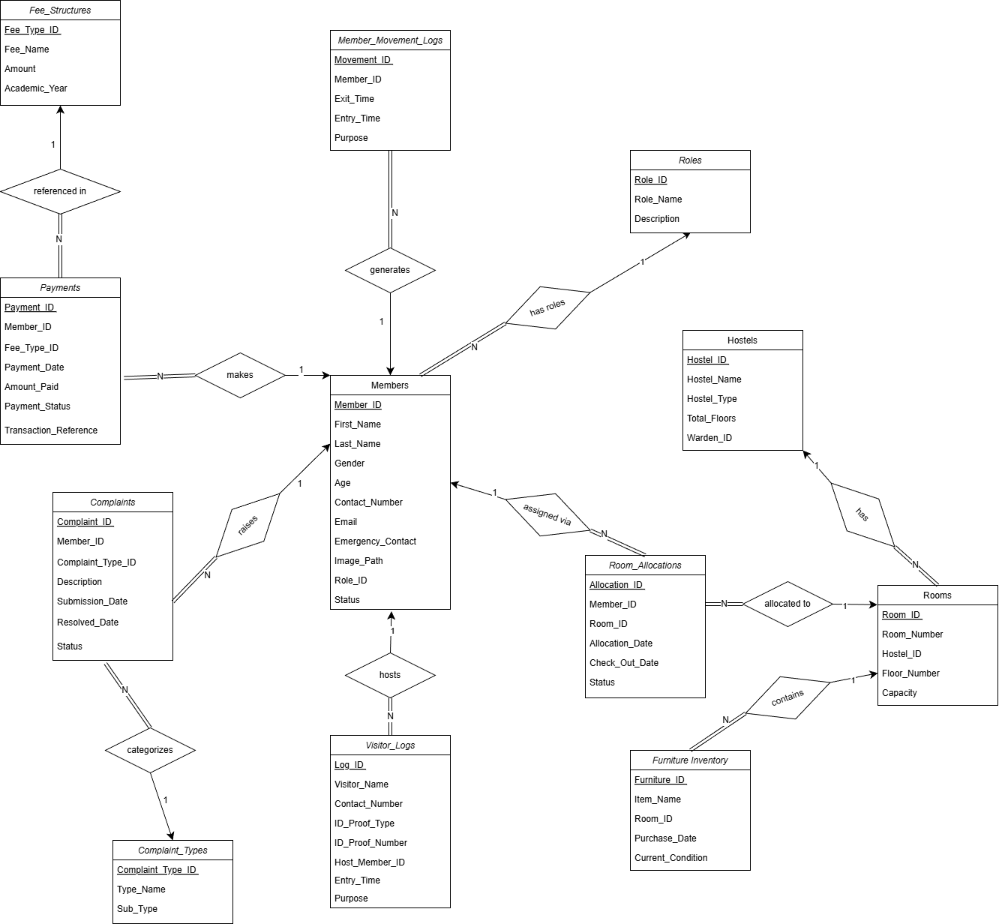

---

# 🏨 StayEase – Hostel Management System

A relational database project designed to digitize and streamline hostel operations such as room allocation, fee management, visitor tracking, complaint handling, and member movement logging.

This project was developed as part of a Database Systems course assignment.

---

## 📌 Problem Statement

Many hostels still rely on manual registers, spreadsheets, or disconnected systems to manage:

* Room assignments
* Fee payments
* Student complaints
* Visitor entries
* Hostel property tracking

This leads to inefficiency, poor transparency, and administrative errors.

**StayEase** provides a structured relational database design to centralize and normalize all hostel operations.

---

## 🎯 Project Objectives

* Design a normalized relational database (3NF compliant)
* Implement strong referential integrity using foreign keys
* Enforce domain and business constraints
* Support real-world hostel workflows
* Maintain data consistency and security

---

## 📊 ER Diagram

---

## 🗂️ Database Design Overview

The system contains **12 strong entities**:

1. Roles
2. Members
3. Hostels
4. Rooms
5. Room_Allocations
6. Furniture_Inventory
7. Visitor_Logs
8. Member_Movement_Logs
9. Fee_Structures
10. Payments
11. Complaint_Types
12. Complaints

---

## 🧩 Entity-Relationship Highlights

* All entities are **strong entities**
* No weak entities required
* No recursive relationships
* No ternary relationships required
* Many-to-many relationships resolved using associative entities
* Total participation used where logically required

### Example Relationships

* Roles → Members (1:N)
* Hostels → Rooms (1:N)
* Members → Room_Allocations (1:N)
* Rooms → Room_Allocations (1:N)
* Members → Payments (1:N)
* Fee_Structures → Payments (1:N)
* Members → Complaints (1:N)
* Complaint_Types → Complaints (1:N)

---

## 🔐 Integrity Constraints

### ✔ Referential Integrity

All foreign keys use:

* `ON UPDATE CASCADE`
* `ON DELETE RESTRICT` or `CASCADE` (where appropriate)

### ✔ Domain Constraints

* Age > 0
* Capacity > 0
* Amount > 0
* Gender restricted values
* Status restricted values
* Valid payment status
* Valid complaint status

### ✔ Business Logic Constraints

* Only one active room allocation per member (logical enforcement)
* Checkout date must be greater than allocation date
* Complaint resolved date required if status is "Resolved"
* Entry time must be after exit time in movement logs

---

## 🧱 Database Schema Features

* Primary Keys in all tables
* Foreign Keys for relational integrity
* Unique constraints for:

  * Email
  * Contact number
  * Transaction reference
  * Room number per hostel
* Composite uniqueness where required
* No redundant relationships
* Normalized design (3NF)

---

## 📊 Core Functional Modules

### 🏠 Room Management

* Allocate rooms to members
* Track historical room changes
* Maintain occupancy via allocations

### 💰 Fee & Payment Management

* Define academic-year fee structures
* Record payments
* Track payment status

### 🛠 Complaint Management

* Categorize complaints
* Track complaint status
* Record resolution dates

### 🚪 Visitor Management

* Log visitor details
* Optionally link visitor to member
* Maintain entry timestamps

### 🚶 Member Movement Tracking

* Record exit and entry times
* Track movement purposes

### 🪑 Furniture Inventory

* Assign furniture to rooms
* Track purchase date
* Maintain condition status

---

## 🧠 Design Decisions

* Surrogate primary keys used for simplicity and consistency
* Associative entities used for relationships with attributes
* No derived attributes stored physically (calculated via queries)
* Hostel assignment derived through room allocation
* Avoided unnecessary direct relationships to maintain normalization

---
